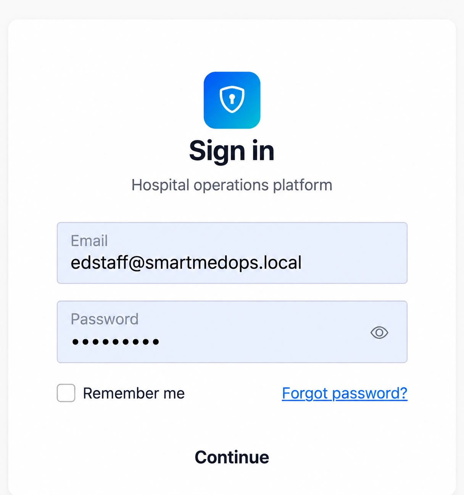
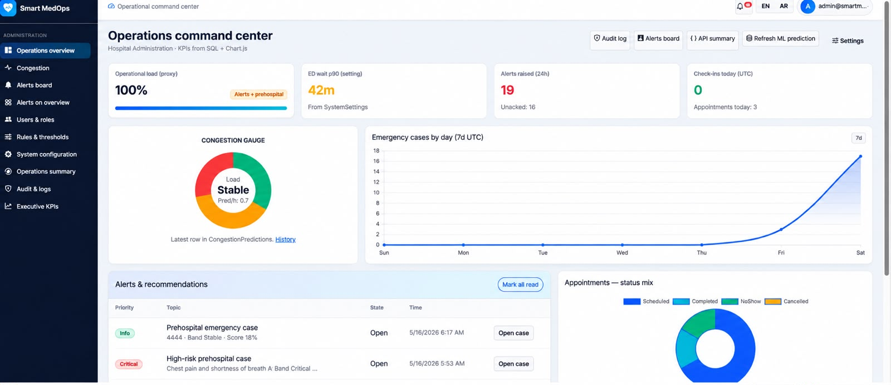
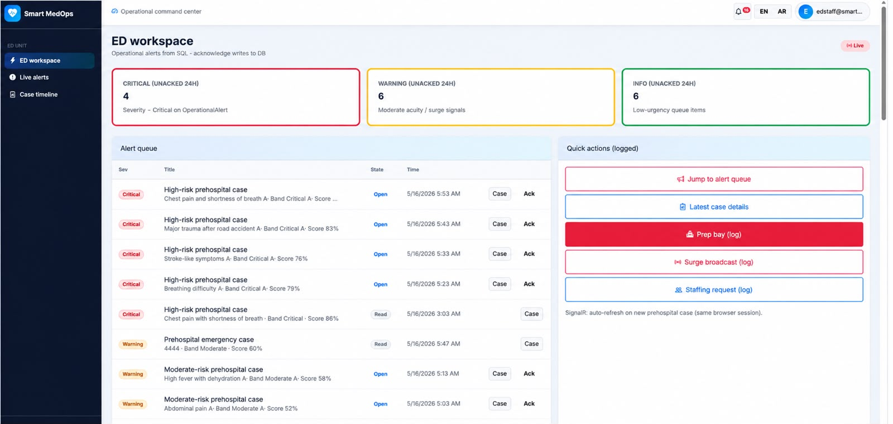
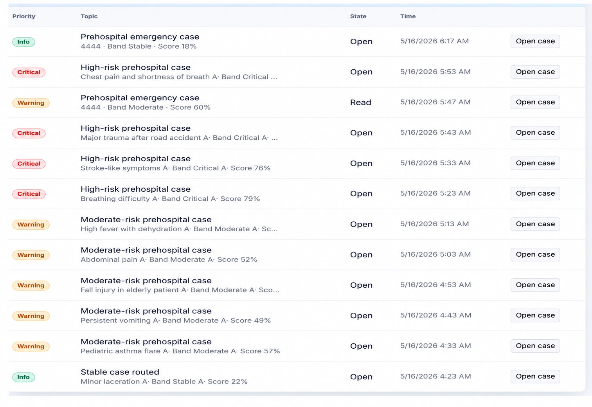

# Smart MedOps

Smart MedOps is a graduation project developed to support hospital operations through a web-based system, data analysis, and machine learning.

The system combines several hospital workflows in one platform, including appointment management, QR-based check-in, emergency case intake, congestion prediction, alerts, and operational dashboards.

## Main Features

- Appointment management
- QR-based patient check-in
- Emergency case intake
- Emergency severity scoring
- Hospital congestion prediction
- Operational alerts
- Role-based access control
- Arabic and English interface
- Real-time notifications
- Audit and monitoring features
- Operational dashboards

## Machine Learning

Machine learning was used to support different parts of the project, including:

- Hospital congestion prediction
- Emergency workload prediction
- Readmission modelling and analysis
- Emergency severity scoring

The machine learning services were developed using Python and integrated with the web system through FastAPI.

## Technologies Used

- ASP.NET Core
- Razor Pages
- C#
- .NET 8
- SQL Server
- Entity Framework Core
- ASP.NET Core Identity
- SignalR
- Python
- FastAPI
- Pandas
- NumPy
- Scikit-learn
- CatBoost
- Joblib
- HTML
- CSS
- Bootstrap
## Screenshots

### Login

### Operations Dashboard

### ED Workspace

### Alerts

## Project Purpose

The goal of Smart MedOps is to support hospital operations by combining data preparation, predictive models, dashboards, alerts, and workflow management in one system.

The project was developed for academic and experimental purposes and is not intended to replace clinical diagnosis or medical decision-making.
Al-Batin  
2026
